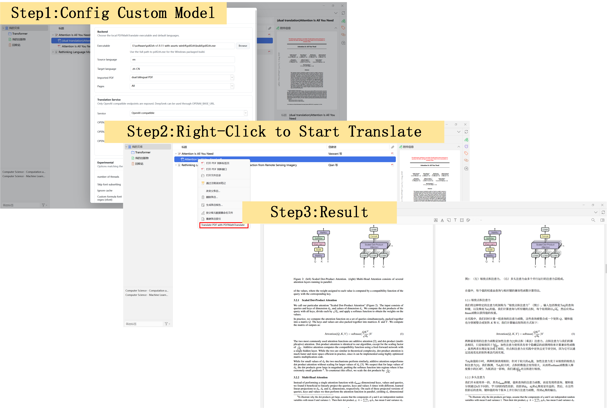

# Zotero Translate PDF



Zotero 7 plugin scaffold for translating PDF attachments with [PDFMathTranslate](https://github.com/PDFMathTranslate/PDFMathTranslate). It adds:

- Right-click menu on Zotero items: `Translate PDF with PDFMathTranslate`
- Tools menu action: `Translate Selected Zotero PDFs`
- Tools menu settings window: `Configure PDF Translation Backend`

The plugin calls a local `pdf2zh` backend, waits for the generated bilingual PDF, and imports the translated PDF as a Zotero child attachment.

## Prerequisites

Install PDFMathTranslate so the `pdf2zh` command is available:

```powershell
pip install pdf2zh
```

If Zotero cannot find `pdf2zh` from `PATH`, open `Tools -> Configure PDF Translation Backend` and set `PDFMathTranslate command or executable path` to the full executable path.

## Development Install

1. Build the extension package:

   ```powershell
   .\build.ps1
   ```

2. In Zotero, open `Tools -> Add-ons`.
3. Choose `Install Add-on From File...`.
4. Select `dist\zotero-translate-0.1.17.xpi`.

If you install or update the plugin while Zotero is already open, disable and re-enable the add-on once, or restart Zotero. The plugin also tries to add menus to already-open Zotero windows on startup.

## Current Backend Command

For each selected PDF, the plugin runs:

```text
pdf2zh <input.pdf> -li <sourceLang> -lo <targetLang> -s <service> -o <temp-output-dir> <extraArgs>
```

By default it attaches the `dual` output. You can switch to `mono` in the plugin settings.

## Notes

- Select PDF attachments directly, or select regular Zotero items that contain PDF attachments.
- The translated PDF is imported into Zotero storage as a child attachment of the parent item.
- The first version intentionally keeps the backend local. A future version can add a small HTTP service wrapper around PDFMathTranslate for progress streaming, cancellation, and queue management.
